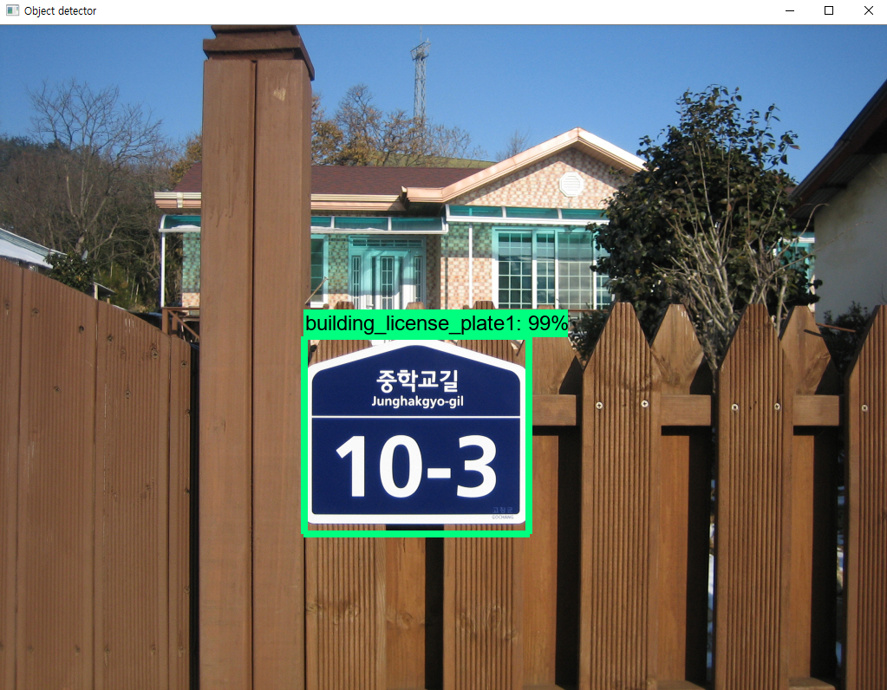
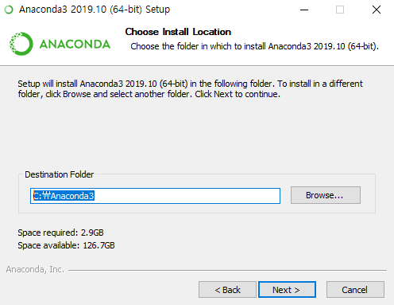
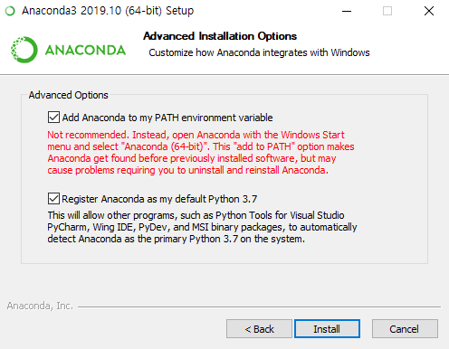
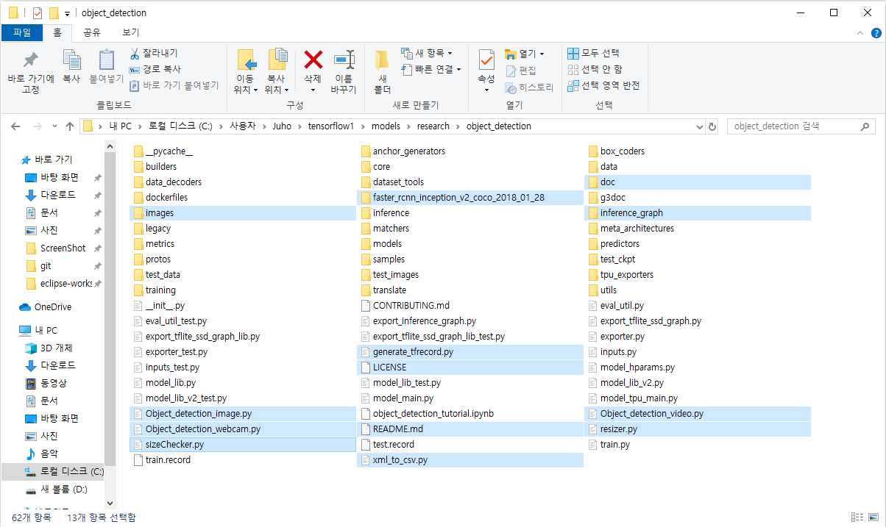

# Detecting Building license plate using TensorFlow Object Detection
## Brief Summary
***last updated: 21/02/2020 with Tensorflow v1.15***  
  
This repertory is a deep learning project that creates models that recognize building license plates as part of Inha University's Winter School project. This project ran on Windows, and all configuration is Windows based. Participants in this project are Lee Ju-ho and Park Ki-soo.  
  
This repository only covers creating models that recognize building plates using Python code on PC, and the rest of the process is covered elsewhere. This repository provides all the files needed to train building plates detector.  
  
This readme describes every steps required to get going with obect detection classifier.  
It also describes how to replace the files with your own files to train a detection classifier for whatever you want. It also has Python scripts to test your classifier out on an image, video, or webcam feed.  
  
This project is inspired by "[How To Train an Object Detection Classifier for Multiple Objects Using TensorFlow (GPU) on Windows 10](https://github.com/EdjeElectronics/TensorFlow-Object-Detection-API-Tutorial-Train-Multiple-Objects-Windows-10#1-install-anaconda-cuda-and-cudnn)"  
  
  
  
## Introduction

The purpose of this project is to create a tensorflow model that can detects building license plate from the image, to make an application that automatically recognizes addresses when photos are taken.  
  
The reason why we need to train a model that recognizes a license plate is that in general, when a picture is taken, it most likely contains other letters besides the license plate. So we should recognize the license plate first, and then recognize the letters.  
In this progress, we will create a model that recognizes building license plates using TensorFlow Object Detection api.  
  
We will use TensorFlow-GPU v1.15. TensorFlow-GPU allows your PC to use the video card to provide extra processing power while training.  
You could use only cpu to train the model but it would take much longer times. If you use CPU-only TensorFlow, you don't need to install CUDA and cuDNN in Step 1.  
  
## Steps
### 1. Install Anaconda, CUDA, and cuDNN

First, you should install Anaconda. You can get [Anaconda here](https://www.anaconda.com/distribution/). Click Python 3.7 version download and run the exe.  
  
Set the file path to install, and click next.  
  
  
  
Check all the checkbox and click install.  
  
  
 

After installing Anaconda, you should install CUDA and cuDNN. To use CUDA, you must have a NVIDIA graphics card that supports CUDA. You can check that your graphics card supports CUDA or not at [here](https://www.geforce.com/hardware/technology/cuda/supported-gpus?field_gpu_type_value=all). If you don't have CUDA supported graphics card, you have to use TensorFlow-CPU only. Then you can skip this step.  
  
If you checked your graphics card supports CUDA, now you should install CUDA 10.1 version. Make sure that you installed 10.1 version instead 10.2 version(latest version). At the time of this writing TensorFlow do not support 10.2 CUDA. Check the version of CUDA that TensorFlow supports. You can get [CUDA 10.1 here](https://developer.nvidia.com/cuda-10.1-download-archive-base?target_os=Windows&target_arch=x86_64&target_version=10&target_type=exelocal).  
I recommend you to download local version. Network version may fail during installation. If you have failed during install, it 
might have conflicted with graphics driver. If you failed, remove your graphics driver and try again.  
  
After installing CUDA, get [cuDNN here](https://developer.nvidia.com/rdp/cudnn-archive). To get cuDNN, you have to join NVIDIA membership. You can download cuDNN after sign in the site. Download cuDNN and extract all files in 'cuda' folder to your CUDA installed path. If you installed CUDA at default path, it would be here "C:\Program Files\NVIDIA GPU Computing Toolkit\CUDA\v10.1".
  

### 2. Install TensorFlow and update Anaconda environment

After step 1, now you should install tensorflow-gpu and conda packages. From the Start menu in Windows, search for the Anaconda Prompt utility, right click on it, and click “Run as Administrator”. If Windows asks you if you would like to allow it to make changes to your computer, click Yes. And update conda by this command.
<pre><code>conda update -n base conda</code></pre>
Next, update all installed Python packages.
<pre><code>conda update --all</code></pre>
Now, install TensorFlow-gpu 1.15 by this command.
<pre><code>pip install tensorflow-gpu==1.15</code></pre>
If you don't have a graphics card or didn't install CUDA, install TensorFlow-cpu only version.
<pre><code>pip install tensorflow==1.15</code></pre>
After install now you are ready to use TensorFlow!
  
#### 2a. Download TensorFlow Object Detection API repository from GitHub

Create a folder directly in C: and name it “tensorflow1”. This working directory will contain the full TensorFlow object detection framework, as well as your training images, training data, trained classifier, configuration files, and everything else needed for the object detection classifier.  
  
Download the full TensorFlow object detection repository located at https://github.com/tensorflow/models by clicking the “Clone or Download” button and downloading the zip file. Open the downloaded zip file and extract the “models-master” folder directly into the C:\tensorflow1 directory you just created. Rename “models-master” to just “models”.

*Note : The TensorFlow models repository's code (which contains the object detection API) is continuously updated by the developers. Sometimes they make changes that break functionality with old versions of TensorFlow. It is usually best to use the latest version of TensorFlow and download the latest models repository. At the time of this writing TensorFlow v1.15 is best to use the latest TensorFlow models repository's code, but if you have problem with using this code try to update your TensorFlow version or download orlder version of TensorFlow models repository. [TF v1.13](https://github.com/tensorflow/models/tree/r1.13.0)*
  
#### 2b. Download the Faster-RCNN-Inception-V2-COCO model from TensorFlow's model zoo  

TensorFlow provides several object detection models (pre-trained classifiers with specific neural network architectures) in its [model zoo](https://github.com/tensorflow/models/blob/master/research/object_detection/g3doc/detection_model_zoo.md). Some models (such as the SSD-MobileNet model) have an architecture that allows for faster detection but with less accuracy, while some models (such as the Faster-RCNN model) give slower detection but with more accuracy.  
  
You can choose which model to train your objection detection classifier on. If you are planning on using the object detector on a device with low computational power (such as a smart phone or Raspberry Pi), use the SDD-MobileNet model. If you will be running your detector on a decently powered laptop or desktop PC, use one of the RCNN models.  
  
In this project we will use the Faster-RCNN-Inception-V2 model. [Download the model here](http://download.tensorflow.org/models/object_detection/faster_rcnn_inception_v2_coco_2018_01_28.tar.gz). Open the downloaded faster_rcnn_inception_v2_coco_2018_01_28.tar.gz file and extract the faster_rcnn_inception_v2_coco_2018_01_28 folder to the C:\tensorflow1\models\research\object_detection folder.  
  
#### 2c. Download this repository from GitHub  

Download the full repository located on this page (scroll to the top and click Clone or Download) and extract all the contents directly into the C:\tensorflow1\models\research\object_detection directory. (You can overwrite the existing "README.md" file.) This establishes a specific directory structure that will be used for the rest of the tutorial.
  
At this point, your \object_detection folder should look like this image:  
  
  
  
This repository contains all images to train building license plate detector, .csv files and already trained models too. You can test my trained building license detector after step 2 is all completed by running Object_detection_image.py script. You can ignore the \doc folder and its files; they are just there to hold the images used for this readme.  
  
If you want to train your own object detector, delete the following files (do not delete the folders):  
- All files in \object_detection\images\train and \object_detection\images\test
- The “test_labels.csv” and “train_labels.csv” files in \object_detection\images
- All files in \object_detection\training
- All files in \object_detection\inference_graph  

After delete all these files you can use your own images to train whatever you want. Following steps will explain how to train your own object detector.  
  
#### 2d. Set up Anaconda environment for Object Detection API  

We have updated Anaconda environment at the beginning of step 2. It has no problem using TensorFlow only. But to use Object Detection API you need to do some more settings.  
  
Frist, run Anaconda promt as Adminitrator and type this command to install protobuf package.
<pre><code>conda install -c anaconda protobuf</code></pre>
Then, install opencv-python by this command.
<pre><code>pip install opencv-python</code></pre>

#### 2e. Configure PYTHONPATH environment variable

A PYTHONPATH variable must be created that points to the \models, \models\research, and \models\research\slim directories. Do this by issuing the following commands. (from any directory)
<pre><code>>set PYTHONPATH=C:\tensorflow1\models;C:\tensorflow1\models\research;C:\tensorflow1\models\research\slim</code></pre>
*Note : Every time Anaconda prompt is exited, the PYTHONPATH variable is reset and needs to be set up again. You can use "echo %PYTHONPATH% to see if it has been set or not.*  
  
#### 2f. Compile Protobufs and run setup.py

Next, compile the Protobuf files, which are used by TensorFlow to configure model and training parameters. In the Anaconda Command Prompt, change directories to the \models\research directory.
<pre><code>cd C:\tensorflow1\models\research</code></pre>
Then copy and paste the following command into the command line and press Enter.
<pre><code>protoc object_detection/protos/*.proto --python_out=.</code></pre>
This creates a name_pb2.py file from every name.proto file in the \object_detection\protos folder.  
  
Finally, run the following commands from the C:\tensorflow1\models\research directory:
<pre><code>python setup.py build  
python setup.py install</code></pre>  
